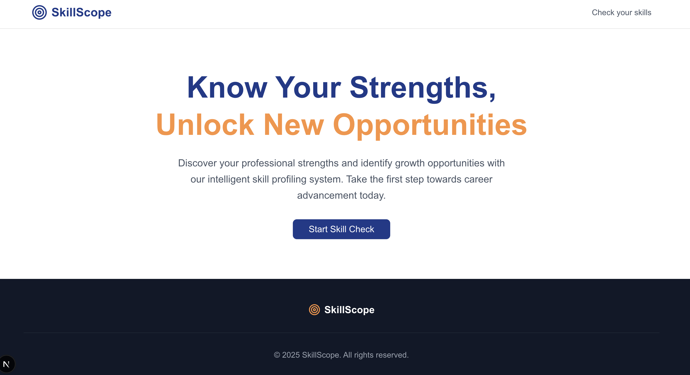

# Muula - AI-Powered Career Advice Platform



## 🚀 About

Muula is an intelligent career advice platform that provides personalized guidance based on your professional background and aspirations. Built with Next.js and powered by AI, it helps users discover new career opportunities and skill development paths.

## ✨ Features

- **AI-Powered Career Advice**: Get personalized career guidance based on your skills and experience
- **Interactive Form**: Easy-to-use interface for sharing your professional background
- **Real-time Responses**: Instant AI-generated advice with detailed recommendations
- **Share Functionality**: Share your career advice with others via native sharing or clipboard
- **Responsive Design**: Works seamlessly on desktop and mobile devices
- **Modern UI**: Clean, professional interface with smooth animations

## 🛠️ Tech Stack

- **Frontend**: Next.js, React, TypeScript
- **Styling**: Tailwind CSS
- **AI Integration**: OpenAI API
- **Markdown Rendering**: React Markdown with GFM support
- **UI Components**: Custom components with modern design

## 🚀 Getting Started

### Prerequisites

- Node.js (v14 or higher)
- npm or yarn
- OpenAI API key

### Installation

1. **Clone the repository**
   ```bash
   git clone https://github.com/yourusername/muula.git
   cd muula
   ```

2. **Install dependencies**
   ```bash
   npm install
   ```

3. **Set up environment variables**
   Create a `.env.local` file in the root directory:
   ```env
   OPENAI_API_KEY=your_openai_api_key_here
   ```

4. **Run the development server**
   ```bash
   npm run dev
   ```

5. **Open your browser**
   Navigate to [http://localhost:3000](http://localhost:3000)

## 📝 Usage

1. **Fill out the form** with your professional information:
   - First and last name
   - Email address
   - Current skill/role
   - Professional experience and achievements

2. **Submit your request** and wait for AI-generated advice

3. **Review your personalized career advice** in the popup drawer

4. **Share or start again** using the provided buttons

## 🎯 How It Works

The platform uses OpenAI's GPT model to analyze your professional background and provide:

- **Summary of your experience**: AI summarizes your professional journey
- **Personalized advice**: Tailored recommendations based on your skills
- **Skill suggestions**: 2 new skill areas to consider for career growth

## 🔧 API Endpoints

- `POST /api/advice`: Processes career advice requests
  - Body: `{ skill: string, message: string }`
  - Returns: AI-generated career advice

## 📱 Features in Detail

### AI Career Coach
- Analyzes your professional background
- Provides actionable career advice
- Suggests new skill development areas
- Offers personalized growth recommendations

### User Experience
- Clean, intuitive interface
- Real-time form validation
- Loading states and error handling
- Responsive design for all devices

### Sharing & Collaboration
- Native sharing on mobile devices
- Clipboard fallback for desktop
- Easy restart functionality
- Persistent session management

## 🤝 Contributing

1. Fork the repository
2. Create a feature branch (`git checkout -b feature/amazing-feature`)
3. Commit your changes (`git commit -m 'Add some amazing feature'`)
4. Push to the branch (`git push origin feature/amazing-feature`)
5. Open a Pull Request

## 📄 License

This project is licensed under the MIT License - see the [LICENSE](LICENSE) file for details.

## 🙏 Acknowledgments

- OpenAI for providing the AI capabilities
- Next.js team for the amazing framework
- Tailwind CSS for the beautiful styling system

---

**Built with ❤️ for career development and growth**
